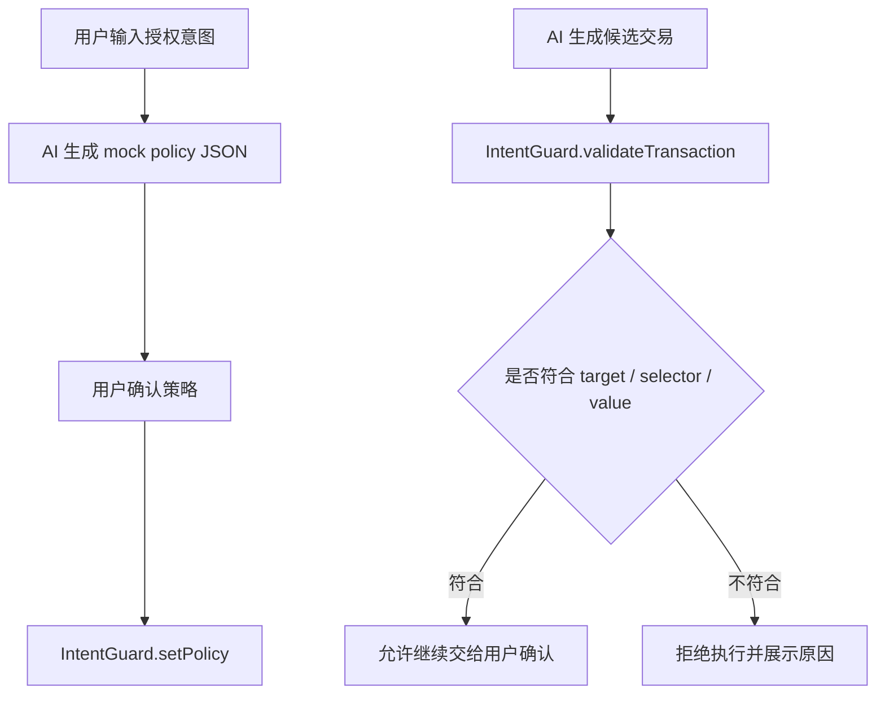

# Dev Builder：核心功能可完成性确认

## 本周最需要完成的核心功能

本周最需要完成的是 `IntentGuard` 的最小策略检查功能。

一句话：

```text
AI 生成一笔候选交易后，IntentGuard 判断它是否符合用户设置的 target、selector、value 限制。
```

最小功能只验证 4 种情况：

- 允许：目标合约是白名单 `CheckIn` 合约
- 允许：函数 selector 是 `checkIn()`
- 拒绝：目标合约不是白名单
- 拒绝：交易携带 MON 或调用非白名单函数

这个功能可以证明项目的核心判断：

```text
AI 可以辅助生成候选操作，但不能绕过链上策略和用户确认。
```

## 可以复用的现有工具、合约、SDK 或代码

可复用内容：

- `CheckIn` 合约：作为测试场景中的白名单合约
- 已有 Monad 测试网交互记录：证明我已经完成过真实链上合约调用
- `IntentGuard` 合约骨架：来自 `doc-ai-skeleton.md`
- mock policy JSON：来自 `intentguard-demo-readme.md`
- Foundry：用于写 Solidity 测试和验证允许 / 拒绝逻辑
- Monad Developer Docs：用于后续部署、RPC、Gas 和浏览器验证
- Moss 文档思路：复用“AI 不签名、不广播、先生成 plan、再模拟 / 检查”的安全边界

已有真实链上证据：

```text
0xd35c2b5174aa72e757ec6aef8d8a352c81391b0b453a507102f367896555d814
```

这笔交易是 `CheckIn.checkIn()` 的 Monad 测试网交互，可以作为本周 Demo 的白名单调用场景。

## 暂时无法完成，需要简化或 Mock 的功能

本周暂时不完成这些功能：

- 真实 LLM API 意图解析
- 完整前端页面
- 钱包自动签名
- session key
- 多合约 / 多协议权限管理
- 真实交易模拟服务
- Monad 测试网部署 `IntentGuard`
- 审计级安全权限系统

需要 Mock 的部分：

- AI 输出：用固定 JSON 表示 AI 生成的策略
- 用户输入：用固定文本表示用户授权意图
- 交易生成：用固定 calldata / selector 表示候选交易
- 展示层：先用 README 和测试输出来解释结果

不能 Mock 的部分：

- `IntentGuard` 的判断规则
- 允许 / 拒绝测试结果
- 真实链上交易 hash 和截图
- 用户最终确认权

## 简单技术方案



## 真实开发部分

本周真实开发部分：

- 创建 `IntentGuard.sol`
- 实现 `setPolicy`
- 实现 `validateTransaction`
- 编写最小测试：
  - 白名单 `CheckIn.checkIn()` 通过
  - 非白名单 target 拒绝
  - 非白名单 selector 拒绝
  - value 大于 `maxValue` 拒绝
  - 未设置策略时拒绝
- 在 README 中说明策略、测试结果和 Known Issues

## Mock 部分

Mock 内容：

```json
{
  "userIntent": "只允许 AI 调用 CheckIn 合约的 checkIn()，禁止转出 MON",
  "policy": {
    "allowedTarget": "0x7d465988fbe510c7b1890e822be4a66078c09b80",
    "allowedSelector": "0x183ff085",
    "maxValue": "0"
  }
}
```

Mock 的原因：

- 本周重点是验证权限检查逻辑，不是训练或接入 AI 模型
- 固定 JSON 已足够证明“自然语言意图可以转成策略参数”
- 先跑通合约测试，比提前开发完整 UI 更重要

## 是否能够完成

判断：

```text
可以完成，但必须继续缩小范围。
```

可完成的版本是：

```text
Foundry 本地测试版 IntentGuard，不做真实 AI、不做自动签名、不做完整前端。
```

当前最大卡点：

- 本地 `forge` 暂时不可用，需要安装 Foundry 或切换到可用开发环境
- `bytes4(data[:4])` 需要真实编译验证，可能要改成 assembly 读取 calldata 前 4 字节

本周验收标准：

```text
只要 5 个测试能证明“允许白名单调用、拒绝越权调用”，Mini Demo 就成立。
```
